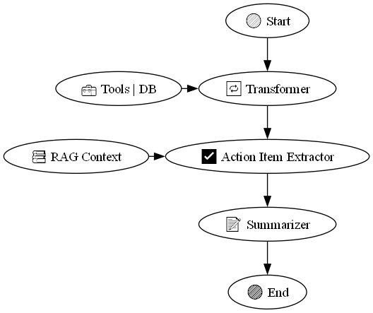

# TEG Project - Multi-Agent Meeting Analysis System

A Python-based solution that leverages Generative AI technologies to analyze meeting transcripts and extract actionable insights using a multi-agent system architecture.

## Features

- **Multi-Agent System**: Utilizes specialized agents for different tasks:
  - Transformer Agent: Processes and structures meeting transcripts
  - Action Items Agent: Extracts and categorizes action items
  - Summarizer Agent: Generates concise meeting summaries
- **RAG Integration**: Retrieval-Augmented Generation for context-aware responses
- **LangSmith Monitoring**: Comprehensive observability and logging
- **Modern UI**: Streamlit-based user interface
- **FastAPI Backend**: Scalable and efficient API endpoints

## Architecture

The system uses a graph-based workflow where different agents process the input sequentially:

1. Transformer Agent processes the raw transcript
2. Action Items Agent extracts actionable items
3. Summarizer Agent generates a concise summary



## Setup

1. Clone the repository:

```bash
git clone [repository-url]
cd TEG-Project
```

2. Create and activate a virtual environment:

```bash
python -m venv .venv
source .venv/bin/activate  # On Windows: .venv\Scripts\activate
```

3. Install dependencies:

```bash
pip install -r requirements.txt
```

4. Set up required API keys:

Create a `.env` file in the project root with the following content:

```env
# OpenAI API Key
OPENAI_API_KEY=your-openai-api-key

# LangSmith Configuration
LANGSMITH_TRACING=true
LANGSMITH_ENDPOINT="https://api.smith.langchain.com"
LANGSMITH_API_KEY=your-langsmith-api-key
LANGSMITH_PROJECT="TEG-2025"
```

You can get these keys from:

- OpenAI API Key: https://platform.openai.com/api-keys
- LangSmith API Key: https://smith.langchain.com/settings/api-keys

## Running the Application

### Development Mode

Start both frontend and backend in development mode:

Backend:

```bash
python -m uvicorn app.backend.main:app --reload
```

Frontend:

```bash
python -m streamlit run app/app.py
```

## Project Structure

```
TEG-Project/
├── app/
│   ├── backend/
│   │   ├── agents/        # Multi-agent system
│   │   ├── rag/           # RAG implementation
│   │   ├── prompts/       # All agents prompts toml
│   │   └── main.py        # FastAPI application
│   ├── utils/             # Utility functions
│   └── app.py             # Streamlit frontend
├── logs/                  # Application logs
├── .env                   # Environment variables
└── requirements.txt       # Project dependencies
```

## Development

- The project uses Python 3.10+
- Dependencies are managed through `requirements.txt`
- Code formatting and linting tools are configured in `pyproject.toml`

## Contributing

1. Create a new branch for your feature
2. Make your changes
3. Submit a pull request

## Acknowledgments

- Built as part of the Generative AI Technologies (TEG) course
- Uses OpenAI's GPT models for natural language processing
- Implements LangChain for agent orchestration
